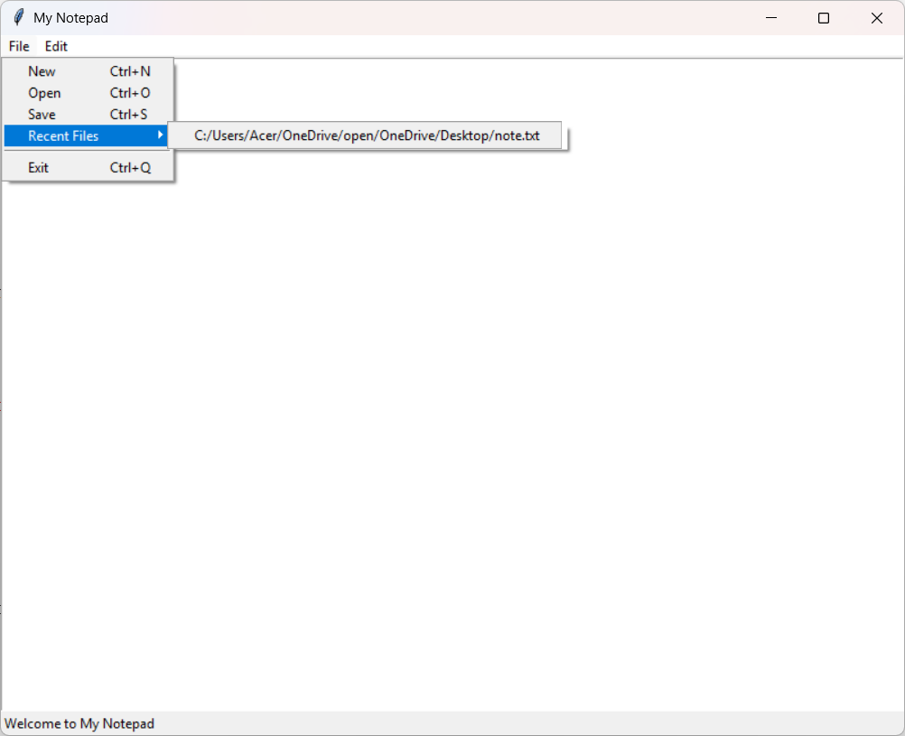

# 📝 My Notepad - Python GUI Text Editor

##Description
A beginner-friendly, fully functional **text editor** built with Python using the `tkinter` library. Designed for students, interns, and hobby developers to learn GUI programming, file handling, and basic productivity app development.

## 🚀 Features

- **🆕 New File:** Create a blank text document.
- **📂 Open File:** Open `.txt` or any text-based file.
- **💾 Save File:** Save the current document.
- **🕒 Auto Save:** Automatically saves your file every 30 seconds.
- **📦 Backup System:** Saves a timestamped `.bak` backup file every time you manually save.
- **📁 Recent Files:** Quick access to the last 5 opened files.
- **🔍 Find Text:** Search and highlight specific words in the document.
- **🖊 Text Formatting:** Apply **Bold** and **Italic** formatting to selected text.
- **📊 Word & Character Count:** Live display of total words and characters.
- **⌨️ Shortcuts:** Use keyboard shortcuts like `Ctrl+S`, `Ctrl+F`, `Ctrl+B`, etc.

## 🛠 Folder Structure
Notepad/
├── AppNote.py # Main Python application
├── recent.txt # Stores the list of recent files when you save it 
├── backups/ # Auto-created folder for backup files

## 📦 Backup System

- After each manual save, a backup file is created in the `backups/` folder.
- Format: `filename_YYYYMMDD_HHMMSS.bak`
- Useful in case of accidental overwrites or crashes.

## 🔄 Auto Save

- Automatically saves your document every 30 seconds (if saved once).
- Displays time of last auto-save in the status bar.
- Reduces risk of data loss during long writing sessions.

## 🧠 Learning Goals

This project helps beginners and interns learn:

- `tkinter` GUI design
- File handling in Python
- Menu creation and keyboard bindings
- Auto-save & backup logic
- Status bar and text tagging for formatting
- Project structure and documentation practices

## 📑 Keyboard Shortcuts

| Action        | Shortcut     |
|---------------|--------------|
| New File      | Ctrl + N     |
| Open File     | Ctrl + O     |
| Save File     | Ctrl + S     |
| Exit App      | Ctrl + Q     |
| Find Text     | Ctrl + F     |
| Bold Text     | Ctrl + B     |
| Italic Text   | Ctrl + I     |

## 💻 How to Run

1. Install [Python 3](https://www.python.org/downloads/) or pycharm
2. Save the code as `AppNote.py`
3. Run the program:

##About the Author
👨‍🎓 Dondapati Theerdha Purushotham
🎓 3rd year, B.Tech CSE (AI & ML) Student

##📜 License
This project is free for educational and personal use. Attribution appreciated.

##Support
Let me know if you’d like to add images, GIFs, or a logo to the README as well, Mr. Porus!
